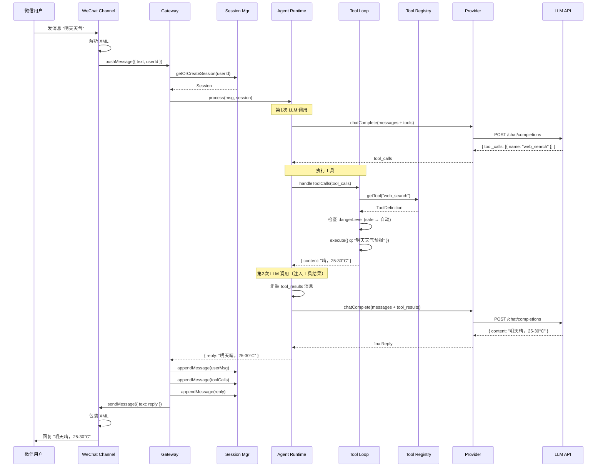
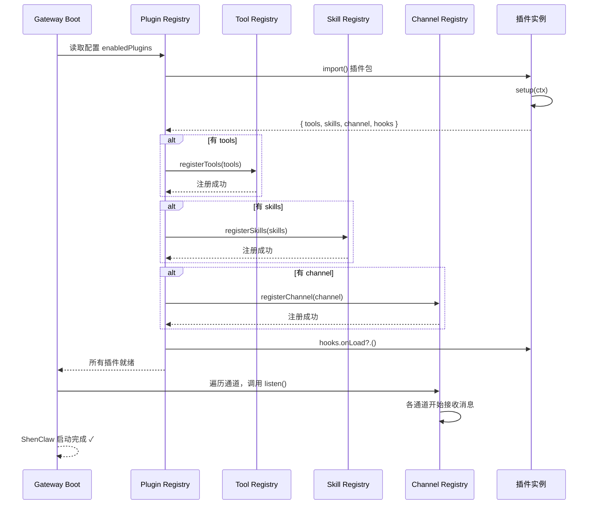
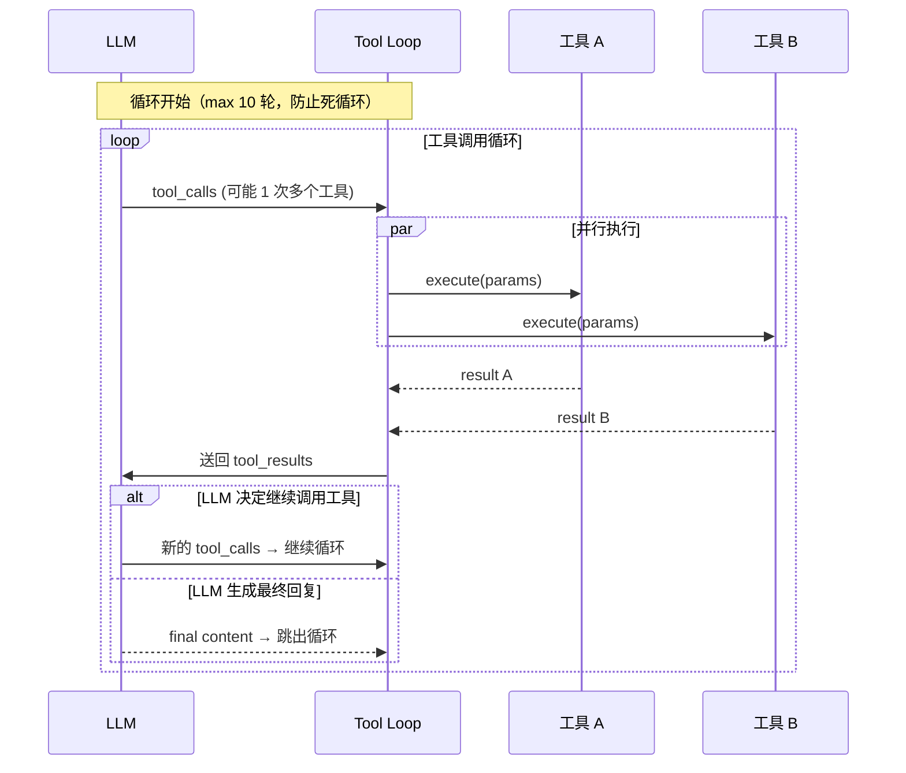

# ShenClaw 轻量级 AI 代理框架 — 架构设计文档 v2

> **文档状态**：v0.2 · 已补全 Plugin/Skill/Tool 体系  
> **灵感来源**：OpenClaw (https://github.com/openclaw/openclaw)  
> **目标**：构建一个轻量化、可自举的 AI 代理框架，首批支持微信与 Telegram 接入，具备完整的工具调用（Tool Calling）和技能（Skill）扩展能力。

---

## 目录

1. [设计理念](#1-设计理念)
2. [架构总览：四层模型](#2-架构总览四层模型)
3. [核心模块清单与职责](#3-核心模块清单与职责)
4. [Plugin 插件系统](#4-plugin-插件系统)
5. [Tool 工具系统](#5-tool-工具系统)
6. [Skill 技能系统](#6-skill-技能系统)
7. [技术栈建议](#7-技术栈建议)
8. [项目目录结构](#8-项目目录结构)
9. [核心流程与交互图](#9-核心流程与交互图)
10. [微信与 Telegram 接入指南](#10-微信与-telegram-接入指南)
11. [开发路线图](#11-开发路线图)

---

## 1. 设计理念

### 四原则

1. **模块化内核，插件化外延**  
   核心只做三件事：消息路由、生命周期管理、工具调度。一切外部能力（消息通道、模型提供商、工具）都是可插拔的插件。

2. **三层抽象 + 一层能力**  
   ```
   Channel Layer (通道) → Gateway Layer (路由/会话) → Agent Layer (智能体) → Provider Layer (模型)
                                    ↕
                            Plugin/Skill Layer (能力层)
   ```
   Plugin/Skill 层横跨 Gateway 和 Agent——Gateway 负责插件注册和生命周期，Agent 负责在 LLM 对话中按需调用工具。

3. **配置即声明**  
   使用 TypeScript 接口 + Zod schema 驱动配置，一个 `shenclaw.config.ts` 文件描述所有模块、通道、提供者和插件。

4. **生产就绪，但不臃肿**  
   取 OpenClaw 的核心架构精华：插件注册机制、工具调用流水线、通道适配模式、会话上下文管理；去掉企业级特性（多租户、MCP、Codex 集成等），聚焦于一条清晰的消息链路：用户输入 → 智能体理解 → 工具调用 → LLM 推理 → 返回回复。

### 与 OpenClaw 的核心差异（取舍哲学）

| 维度 | OpenClaw | ShenClaw |
|:---|:---|:---|
| 插件注册 | `definePluginEntry()` 复杂声明（支持 30+ 钩子） | `definePlugin()` 精简声明（5 个核心钩子） |
| 工具定义 | `tool-plugin.ts` + `provider-tools.ts` 两层 | 单层 `ToolDefinition` 直接绑定执行函数 |
| 技能 | `.agents/skills/` 目录 + SKILL.md + 工具目录 | 简化为插件内注册技能 + 描述文档 |
| 提供者 | 完整流式框架（provider-stream, SSE, Tool Stream） | 统一 fetch API + 可选流式 |
| 通道 | 20+ 通道、复杂生命周期 | 聚焦 Telegram + 微信，通道接口精简 |

---

## 2. 架构总览：四层模型

```
┌─────────────────────────────────────────────────────────┐
│                     Plugin Layer                          │
│  ┌──────────┐  ┌──────────┐  ┌──────────┐               │
│  │ Channel  │  │ Provider │  │  Tools   │  Skills       │
│  │ Plugins  │  │ Plugins  │  │  Plugins │  (技能包)     │
│  └────┬─────┘  └────┬─────┘  └────┬─────┘               │
└───────┼─────────────┼──────────────┼─────────────────────┘
        │             │              │
        ▼             ▼              ▼
┌─────────────────────────────────────────────────────────┐
│                     Gateway Layer                         │
│  ┌─────────┐  ┌──────────┐  ┌────────────┐              │
│  │  Boot   │  │ Registry │  │ Lifecycle  │              │
│  │ 启动流程 │  │ 模块注册表 │  │  生命周期   │              │
│  └─────────┘  └──────────┘  └────────────┘              │
│  ┌─────────┐  ┌───────────────┐                          │
│  │ Config  │  │ Session Mgr   │                          │
│  │ 配置系统 │  │  会话管理      │                          │
│  └─────────┘  └───────────────┘                          │
└─────────────────────────────────────────────────────────┘
        │
        ▼
┌─────────────────────────────────────────────────────────┐
│                     Agent Layer                           │
│  ┌──────────────────────────────────────────┐            │
│  │         Agent Runtime (代理运行时)          │            │
│  │  ┌─────────┐  ┌──────────┐  ┌─────────┐  │            │
│  │  │ Prompt  │  │  Tool    │  │  Reply  │  │            │
│  │  │  Builder │  │  Executor │  │  Parser │  │            │
│  │  └─────────┘  └──────────┘  └─────────┘  │            │
│  └──────────────────────────────────────────┘            │
└─────────────────────────────────────────────────────────┘
        │
        ▼
┌─────────────────────────────────────────────────────────┐
│                   Provider Layer                          │
│  ┌──────────┐  ┌──────────┐  ┌──────────┐               │
│  │ OpenAI   │  │ DeepSeek │  │ 更多...  │               │
│  │ Compat   │  │          │  │          │               │
│  └──────────┘  └──────────┘  └──────────┘               │
└─────────────────────────────────────────────────────────┘
```

### 一条完整的消息流（俯瞰）

```
微信消息 → WeChat Channel (解析) → Gateway (路由+会话) 
  → Agent Runtime (组装消息+工具列表) → Provider (LLM API)
  → LLM 返回文本或工具调用请求 → Tool Executor (执行工具)
  → 工具结果送回 LLM → LLM 综合生成最终回复 
  → Agent Runtime (解析回复) → Gateway (回写会话) → WeChat Channel (发回)
```

---

## 3. 核心模块清单与职责

### 3.1 Gateway（核心调度器）

| 条目 | 内容 |
|:---|:---|
| **主职责** | 系统启动、模块注册、消息路由、会话管理、生命周期控制 |
| **借鉴 OpenClaw** | `src/gateway/boot.ts`（启动流程）、`auth.ts`（认证）、`agent-command.ts`（代理命令） |
| **子模块** | Boot（启动编排）、Registry（模块注册表）、Lifecycle（优雅启停） |

### 3.2 Channel（通道适配器）

| 条目 | 内容 |
|:---|:---|
| **主职责** | 连接外部消息平台，统一化为内部 `Message` 格式 |
| **接口契约** | `listen()` → `onMessage(msg)` → `send(target, reply)` |
| **借鉴 OpenClaw** | `extensions/telegram/src/channel.ts`（通道注册）、`bot-core.ts`（消息接收） |

### 3.3 Provider（模型提供者）

| 条目 | 内容 |
|:---|:---|
| **主职责** | 封装 LLM API 调用，支持流式/非流式回复，返回符合 OpenAI Chat API 格式的结果 |
| **接口契约** | `chatComplete(messages, tools?, opts?) → Response` |
| **借鉴 OpenClaw** | `provider-stream.ts`（流式通信契约），ShenClaw 简化，统一走 fetch |

### 3.4 Agent Runtime（代理运行时）← **核心改造点**

| 条目 | 内容 |
|:---|:---|
| **主职责** | 管理一次对话的完整生命周期：组装请求 → 发送 LLM → 解析工具调用 → 执行工具 → 送回结果 → 输出最终回复 |
| **工作流程** | 见下方"含工具调用的消息处理流程" |
| **借鉴 OpenClaw** | `agent-harness-runtime.ts`（Agent 执行引擎）、`agent-runtime.ts`（运行时封装） |

### 3.5 Tool Executor（工具执行器）← **新增核心模块**

| 条目 | 内容 |
|:---|:---|
| **主职责** | 注册、查找、执行工具。Agent Runtime 在 LLM 返回 tool_calls 时调用它执行对应工具，将结果返回给 Agent Runtime |
| **工具来源** | 内置工具（web_search、web_fetch、file_ops 等）+ 插件注册的工具 + 技能包注册的工具 |
| **安全** | 危险操作（shell 执行、文件写入）需用户确认 |
| **借鉴 OpenClaw** | `src/agents/tools/` 下每个目录是一个工具实现；`tool-plugin.ts` 定义了工具插件的注册方式 |

### 3.6 Session Manager（会话管理器）

| 条目 | 内容 |
|:---|:---|
| **主职责** | 用户会话的 CRUD、历史消息裁剪（Token 限制）、会话持久化与恢复 |
| **新增** | 会话中记录 tool_calls 和 tool_results，确保 LLM 能理解完整的工具调用上下文 |

### 3.7 Plugin Registry（插件注册表）← **新增核心模块**

| 条目 | 内容 |
|:---|:---|
| **主职责** | 管理所有插件的注册与发现。插件可以注册：工具、通道、提供者、生命周期钩子、HTTP 路由 |
| **借鉴 OpenClaw** | `plugin-entry.ts` 中的 `definePluginEntry()` 是多功能入口；`tool-plugin.ts` 是工具插件特化 |

### 3.8 Skill Manager（技能管理器）← **新增核心模块**

| 条目 | 内容 |
|:---|:---|
| **主职责** | 管理技能包（Skill Bundle）。技能是"带上下文的工具集合"——一个技能包含一组关联的工具 + 一篇 SKILL.md 文档，告诉 LLM 什么时候该用这些工具 |
| **借鉴 OpenClaw** | `.agents/skills/` 目录下的每个技能文件夹包含 SKILL.md 和工具实现 |

### 3.9 Config（配置系统）

| 条目 | 内容 |
|:---|:---|
| **主职责** | 加载 `shenclaw.config.ts`，用 Zod schema 校验，提供全局配置访问 |

### 3.10 Logger（日志系统）

| 条目 | 内容 |
|:---|:---|
| **主职责** | 结构化日志，支持多级别，输出到控制台+文件 |

---

## 4. Plugin 插件系统

这是 ShenClaw 能力扩展的基石。插件的核心思想：**任何扩展能力（工具、通道、提供者）都以统一的方式注册到 Registry 中，核心代码只通过接口调用，不感知具体实现。**

### 4.1 插件定义接口

```typescript
// src/plugin/types.ts

/** 插件元数据 */
interface PluginManifest {
  name: string;           // 唯一标识，如 "shenclaw-tool-web-search"
  version: string;        // 语义化版本
  description?: string;
  author?: string;
}

/** 插件可注册的能力类型 */
interface PluginCapabilities {
  // 注册工具（函数调用）
  tools?: ToolDefinition[];
  // 注册技能包
  skills?: SkillDefinition[];
  // 注册通道适配器
  channel?: IChannelPlugin;
  // 注册模型提供者
  provider?: IProviderPlugin;
  // 生命周期钩子
  hooks?: {
    onLoad?: () => void | Promise<void>;
    onUnload?: () => void | Promise<void>;
    onConfigReload?: () => void | Promise<void>;
  };
  // 插件自己的配置 schema（Zod）
  configSchema?: ZodType<any>;
}

/** 插件入口 */
interface ShenClawPlugin {
  manifest: PluginManifest;
  setup: (ctx: PluginContext) => PluginCapabilities | Promise<PluginCapabilities>;
}

// ≡ 注册函数 ≡
function definePlugin(plugin: ShenClawPlugin): ShenClawPlugin;
```

### 4.2 插件注册与发现机制

```
启动流程中的插件加载：

1. Gateway Boot 启动
2. 扫描配置中 enabledPlugins 列表
3. 对每个插件：
   a. require() 或 import() 插件包
   b. 调用 plugin.setup(ctx) 获取 capabilities
   c. 将 tools 注册到 Tool Registry
   d. 将 channel 注册到 Channel Registry
   e. 将 provider 注册到 Provider Registry
   f. 绑定生命周期钩子
4. 验证依赖：确保工具、通道等能力已就绪
5. 启动通道（调用 channel.listen()）
```

### 4.3 内置插件 vs 外部插件

| 类型 | 位置 | 用途 |
|:---|:---|:---|
| **内置插件** | `src/plugins/builtins/` | 随 ShenClaw 核心一起发布，默认启用（如 web_search、shell 等基础工具） |
| **外部插件** | `channels/`、`providers/` 或独立 npm 包 | 社区开发的通道/提供者/自定义工具 |

### 4.4 插件配置示例

```typescript
// shenclaw.config.ts
export default defineConfig({
  plugins: {
    // 显式启用/配置插件
    "shenclaw-tool-web": {
      enabled: true,
      options: {
        searchProvider: "duckduckgo",
      },
    },
    "shenclaw-tool-shell": {
      enabled: true,
      allowCommands: ["git", "npm", "node", "ls", "cat", "curl"],
    },
  },
});
```

---

## 5. Tool 工具系统

工具（Tool）是 ShenClaw 的"手"——让 LLM 不仅能说，还能做。工具系统借鉴 OpenAI Function Calling 和 OpenClaw 的 `tool-plugin.ts` 设计。

### 5.1 工具定义

```typescript
// src/tools/types.ts

/** 工具参数定义的 JSON Schema（OpenAI Function Calling 兼容格式） */
type JsonSchema = {
  type: "object";
  properties: Record<string, unknown>;
  required?: string[];
  description?: string;
};

/** 工具执行上下文 */
interface ToolContext {
  api: ShenClawApi;          // ShenClaw 公开 API
  signal?: AbortSignal;      // 取消信号
  toolCallId: string;        // 本次工具调用的 ID（用于跟踪）
  session: Session;          // 当前会话
  userId: string;            // 当前用户
}

/** 工具执行结果 */
interface ToolResult {
  content: string;           // 返回给 LLM 的文本
  isError?: boolean;         // 是否执行出错
  metadata?: Record<string, unknown>; // 额外元数据
}

/** 工具定义 */
interface ToolDefinition {
  // ========== LLM 可见的部分（OpenAI tool calling 格式）==========
  name: string;              // 工具名称（唯一，LLM 用这个名字调用）
  description: string;       // 工具描述（LLM 据此决定是否调用）
  parameters: JsonSchema;    // 参数 JSON Schema
  
  // ========== 执行实现 ==========
  execute: (params: Record<string, unknown>, ctx: ToolContext) => ToolResult | Promise<ToolResult>;
  
  // ========== 安全管理 ==========
  dangerLevel?: "safe" | "confirm" | "forbidden";
  // safe: 自动执行
  // confirm: 执行前需要用户确认
  // forbidden: 禁止执行
  
  // ========== 元数据 ==========
  category?: string;         // 工具分类，如 "web", "file", "system"
  pluginId?: string;         // 所属插件 ID
}
```

### 5.2 工具注册与生命周期

```
Plugin.setup() → 返回 tools 数组
       ↓
Gateway Registry 接收，校验 name 唯一性
       ↓
Agent Runtime 从 Registry 获取所有已启用的工具
       ↓
组装 LLM 请求时，将 tools 转为 OpenAI tools 格式
       ↓
LLM 返回 tool_calls → Tool Executor 查找并执行
       ↓
结果组装送 LLM → LLM 根据结果继续推理或生成最终回复
```

### 5.3 完整的 Tool Calling 循环

```
用户: "帮我查一下明天的天气"
       ↓
Agent 组装请求 → [系统提示 + 历史 + 用户消息 + 工具列表]
       ↓
LLM 响应 → { role: "assistant", tool_calls: [
  { id: "call_1", type: "function",
    function: { name: "web_search", arguments: '{"q":"明天天气预报"}' } }
]}
       ↓
Tool Executor 执行 web_search({ q: "明天天气预报" })
       ↓
返回结果 → { content: "明天晴，25-32°C" }
       ↓
Agent 将 tool_results 组装为 assistant 消息继续 →
[{ role: "assistant", content: null, tool_calls: [...] },
 { role: "tool", tool_call_id: "call_1", content: "明天晴，25-32°C" }]
       ↓
LLM 第二次推理（注入工具结果）→ 生成最终回复
       ↓
"明天天气不错，晴，温度 25-32°C，适合出门活动。"
       ↓
Channel 发送给用户
```

### 5.4 内置工具清单（随 ShenClaw 核心发布）

| 工具名称 | 分类 | 说明 | 危险等级 |
|:---|:---|:---|:---|
| `web_search` | 🌐 Web | 搜索引擎查询（默认 DuckDuckGo/Brave） | safe |
| `web_fetch` | 🌐 Web | 获取 URL 内容并提取文本 | safe |
| `shell_exec` | ⚡ System | 执行 Shell 命令（受限名单） | **confirm** |
| `file_read` | 📁 File | 读取文件内容 | **confirm** |
| `file_write` | 📁 File | 写入文件 | **confirm** |
| `file_list` | 📁 File | 列出目录 | confirm |
| `cron_add` | ⏰ Timer | 添加定时任务/提醒 | safe |
| `cron_list` | ⏰ Timer | 查看定时任务 | safe |
| `cron_remove` | ⏰ Timer | 删除定时任务 | safe |
| `image_generate` | 🎨 Media | AI 生成图片 | safe |

### 5.5 工具调用在消息中的格式

ShenClaw 采用 OpenAI 标准 Function Calling 格式，同时兼容 DeepSeek、通义千问等主流 API：

**请求时发给 LLM：**
```json
{
  "messages": [...],
  "tools": [
    {
      "type": "function",
      "function": {
        "name": "web_search",
        "description": "Search the web for information",
        "parameters": {
          "type": "object",
          "properties": {
            "q": { "type": "string", "description": "Search query" }
          },
          "required": ["q"]
        }
      }
    }
  ],
  "tool_choice": "auto"
}
```

**LLM 返回工具调用：**
```json
{
  "choices": [{
    "message": {
      "role": "assistant",
      "content": null,
      "tool_calls": [{
        "id": "call_abc123",
        "type": "function",
        "function": {
          "name": "web_search",
          "arguments": "{\"q\":\"明天北京天气\"}"
        }
      }]
    }
  }]
}
```

**工具结果送回：**
```json
{
  "role": "tool",
  "tool_call_id": "call_abc123",
  "content": "明天北京晴转多云，25-32°C"
}
```

---

## 6. Skill 技能系统

技能（Skill）是**带上下文的工具组合包**。如果说 Tool 是单个"动作"，Skill 就是"战术"——它告诉 LLM 在什么场景下使用哪些工具，以及如何使用。

### 6.1 技能定义

```typescript
// src/skills/types.ts

interface SkillDefinition {
  name: string;              // 技能唯一标识，如 "web-research"
  label: string;             // 人类可读名称，如 "网络研究"
  description: string;       // 技能描述（LLM 理解用）
  
  // 技能绑定的工具（引用已注册的工具名）
  tools: string[];
  
  // 系统提示词增强（注入到系统消息中，告诉 LLM 如何使用这些工具）
  systemPrompt?: string;
  
  // 技能激活条件
  activation?: {
    // 关键词触发技能
    keywords?: string[];
    // 始终启用
    alwaysOn?: boolean;
  };
  
  // 关联的文档路径
  guidePath?: string;        // SKILL.md 路径
  
  // 所属插件
  pluginId?: string;
}
```

### 6.2 技能与 OpenClaw Skills 的对应关系

在 OpenClaw 中，`.agents/skills/` 下的每个技能文件夹包含：
- `SKILL.md` — 告诉 LLM 该技能是什么、怎么用、有什么限制
- 工具实现（ts 文件）— 具体能力

在 ShenClaw 中，技能简化为：
- 注册时声明 `tools` 列表（引用已注册的工具）+ 一段 `systemPrompt`
- `SKILL.md` 作为可选的详细文档，挂载在 `guidePath`
- 技能可以按需激活或常驻

### 6.3 技能在提示词中的注入机制

```
系统提示词（固定部分）:
"你是 ShenClaw，一个轻量级 AI 代理助手。你可以使用以下工具..."

已启用的技能 → 注入技能描述:
"[技能: 网络研究] 你可以使用 web_search 和 web_fetch 工具查询实时信息。
 当用户问到新闻、天气、最新资讯时，优先使用 web_search。"

已注册的工具列表 → 转为 OpenAI tools 格式:
[
  { name: "web_search", description: "...", parameters: {...} },
  { name: "web_fetch", description: "...", parameters: {...} },
  ...
]
```

### 6.4 内置技能包

| 技能名称 | 标签 | 包含工具 | 用途 |
|:---|:---|:---|:---|
| `web-research` | 网络研究 | web_search, web_fetch | 查资料、搜新闻、读网页 |
| `file-ops` | 文件操作 | file_read, file_write, file_list | 读写编辑文件 |
| `system-admin` | 系统管理 | shell_exec | 执行开发命令 |
| `scheduler` | 定时任务 | cron_add, cron_list, cron_remove | 设置提醒和定时任务 |

### 6.5 技能配置示例

```typescript
// shenclaw.config.ts
export default defineConfig({
  skills: {
    "web-research": { enabled: true },
    "file-ops": { enabled: true },
    "system-admin": { 
      enabled: true,
      options: { allowedCommands: ["git", "npm", "node", "ls", "cat"] }
    },
    "scheduler": { enabled: true },
  },
});
```

---

## 7. 技术栈建议

| 层 | 技术 | 理由 |
|:---|:---|:---|
| **语言** | TypeScript 5.x | 静态类型保障插件接口安全；与 OpenAI/DeepSeek SDK 天然兼容 |
| **运行时** | Node.js >= 22 (LTS) | 原生 fetch、Web Streams；与 OpenClaw 一致 |
| **HTTP 框架** | Hono | ~14KB，TypeScript 原生，路由简洁，适合 Webhook 端点 |
| **Schema 校验** | Zod | 类型推导自然，插件 config schema 校验 |
| **日志** | Pino | 最快 JSON 日志库 |
| **测试** | Vitest | 极速，TypeScript 原生 |
| **包管理** | pnpm | monorepo 友好 |
| **格式/检查** | Biome | 比 ESLint+Prettier 快 10x+ |

---

## 8. 项目目录结构

```
shenclaw/
├── package.json                       # 根配置
├── pnpm-workspace.yaml                # monorepo 配置
├── tsconfig.json                      # TS 编译配置
├── shenclaw.config.ts                 # 主配置文件（用户编辑）
│
├── src/
│   ├── index.ts                       # 入口：解析配置 → 启动 Gateway
│   │
│   ├── gateway/
│   │   ├── index.ts                   # Gateway 主类
│   │   ├── boot.ts                    # 启动流程（配置→注册→加载→启动）
│   │   └── types.ts
│   │
│   ├── agent/
│   │   ├── index.ts                   # Agent 运行时（一次对话的执行引擎）
│   │   ├── prompt.ts                  # 系统提示词构造（含技能注入）
│   │   ├── tool-loop.ts               # Tool Calling 循环（调用LLM→解析tools→执行→送回）
│   │   └── types.ts                   # 消息结构体、角色定义
│   │
│   ├── tools/                         # ← 工具系统
│   │   ├── registry.ts                # 工具注册表（注册/查找/校验）
│   │   ├── executor.ts                # 工具执行器（接收tool_calls → 调度执行 → 返回结果）
│   │   ├── types.ts                   # ToolDefinition, ToolContext, ToolResult
│   │   └── builtins/                  # 内置工具实现
│   │       ├── web-search.ts
│   │       ├── web-fetch.ts
│   │       ├── shell-exec.ts
│   │       ├── file-ops.ts
│   │       ├── cron-tools.ts
│   │       └── image-generate.ts
│   │
│   ├── skills/                        # ← 技能系统
│   │   ├── registry.ts                # 技能注册表
│   │   ├── injector.ts                # 技能提示词注入器（将技能描述注入系统消息）
│   │   ├── types.ts                   # SkillDefinition
│   │   └── builtins/                  # 内置技能描述文件
│   │       ├── web-research.ts
│   │       ├── file-ops.ts
│   │       ├── system-admin.ts
│   │       └── scheduler.ts
│   │
│   ├── plugins/                       # ← 插件系统
│   │   ├── registry.ts                # 插件注册表
│   │   ├── loader.ts                  # 插件加载器（动态 import）
│   │   ├── types.ts                   # ShenClawPlugin, PluginCapabilities, PluginContext
│   │   ├── api.ts                     # ShenClawApi（暴露给插件的核心 API）
│   │   └── builtins/                  # 内置插件（默认启用的基础能力）
│   │       ├── index.ts               # 注册所有内置工具和技能为插件
│   │       ├── web-tools.plugin.ts
│   │       ├── file-tools.plugin.ts
│   │       ├── shell-tools.plugin.ts
│   │       └── cron-tools.plugin.ts
│   │
│   ├── channel/
│   │   ├── registry.ts                # 通道注册表
│   │   ├── base.ts                    # IChannel 接口
│   │   └── types.ts                   # 统一 Message 格式
│   │
│   ├── provider/
│   │   ├── registry.ts                # Provider 注册表
│   │   ├── base.ts                    # IProvider 接口
│   │   ├── openai-compat.ts           # OpenAI 兼容 API 实现
│   │   └── types.ts
│   │
│   ├── session/
│   │   ├── index.ts                   # Session Manager
│   │   ├── store.ts                   # 会话存储（文件 JSON）
│   │   └── types.ts
│   │
│   ├── config/
│   │   ├── index.ts                   # 配置加载与校验
│   │   ├── schema.ts                  # Zod schema
│   │   └── types.ts
│   │
│   ├── logger/
│   │   └── index.ts
│   │
│   └── utils/
│       ├── retry.ts
│       ├── throttle.ts
│       └── env.ts
│
├── channels/                          # 通道适配器（独立子包）
│   ├── telegram/
│   │   ├── package.json
│   │   ├── tsconfig.json
│   │   └── src/
│   │       ├── index.ts               # 插件入口：definePlugin()
│   │       ├── adapter.ts             # Telegram Bot API 封装
│   │       ├── handler.ts             # 消息处理
│   │       └── config.ts
│   │
│   └── wechat/
│       ├── package.json
│       ├── tsconfig.json
│       └── src/
│           ├── index.ts               # 插件入口：definePlugin()
│           ├── adapter.ts             # 微信 API 封装
│           ├── handler.ts             # XML 解析、加解密
│           └── config.ts
│
├── tests/
│   ├── gateway.test.ts
│   ├── agent/
│   │   ├── tool-loop.test.ts          # 测试 Tool Calling 循环
│   │   └── prompt.test.ts
│   ├── tools/
│   │   ├── registry.test.ts
│   │   └── executor.test.ts
│   ├── plugins/
│   │   └── loader.test.ts
│   └── channels/
│       ├── telegram.test.ts
│       └── wechat.test.ts
│
├── data/
│   └── sessions/                      # 会话持久化目录
│
└── logs/                              # 日志目录
```

---

## 9. 核心流程与交互图

### 9.1 含 Tool Calling 的完整消息处理流程（文字描述）

```
第 1 步：用户在微信发送 "帮我查一下明天的天气"
        ↓
第 2 步：微信服务器 → POST Webhook → WeChat Channel
        ↓
第 3 步：WeChat Channel 解析 XML → 统一 Message 格式
        ↓
第 4 步：Gateway Router 接收消息 → Session Manager 获取/创建会话
        ↓
第 5 步：Session Manager 加载历史消息 → 追加新消息
        ↓
第 6 步：Agent Runtime 组装 LLM 请求：
        - 系统提示词（含已启用技能的描述）
        - 对话历史
        - 用户消息
        - 工具列表（从 Tool Registry 获取）
        ↓
第 7 步：调用 Provider → 发送给 LLM（如 DeepSeek）
        ↓
第 8 步：LLM 返回 tool_calls（决定调用 web_search）
        ↓
第 9 步：Agent Runtime 的 Tool Loop 模块：
  9a. 解析 LLM 返回的 tool_calls
  9b. 查找 Tool Registry → 找到 web_search 工具
  9c. 调用 Tool Executor → 执行 web_search({ q: "明天天气预报" })
  9d. 判断危险等级：web_search 为 safe，自动执行
  9e. 获取执行结果
        ↓
第 10 步：Agent Runtime 将 tool_results 组装回 LLM：
        [{ role: "assistant", tool_calls: [...] },
         { role: "tool", tool_call_id: "...", content: "明天晴，25-30°C" }]
        ↓
第 11 步：再次调用 Provider → LLM 综合工具结果与自身知识
        ↓
第 12 步：LLM 返回最终文本回复
        ↓
第 13 步：Agent Runtime 解析最终回复 → 返回 Gateway
        ↓
第 14 步：Gateway → 更新会话（保存用户消息 + 工具调用 + AI 回复）
        ↓
第 15 步：Gateway → WeChat Channel → sendMessage()
        ↓
第 16 步：WeChat Channel 包装为 XML → 回复给用户
        ↓
用户收到："明天北京天气不错，晴，温度 25-30°C，适合出门活动。"
```

### 9.2 含 Tool Calling 的 Mermaid 序列图



### 9.3 插件启动注册流程



### 9.4 多条工具调用的循环（高级场景）



---

## 10. 微信与 Telegram 接入指南

### 10.1 Telegram 接入

#### 所需凭证

| 凭证 | 说明 | 获取方式 |
|:---|:---|:---|
| **Bot Token** | `123456:ABC-def_xyz` 格式 | `@BotFather` → `/newbot` |

#### 步骤

1. 在 Telegram 搜索 `@BotFather`，创建 Bot，保存 Token
2. 选择方式：
   - **Polling（开发推荐）**：无需配置，ShenClaw 自动轮询
   - **Webhook（生产）**：`curl -X POST "https://api.telegram.org/bot<TOKEN>/setWebhook?url=<YOUR_URL>"`
3. 在 `shenclaw.config.ts` 中配置 `channels.telegram`

```typescript
// Telegram 通道的插件式配置
channels: {
  telegram: {
    enabled: true,
    botToken: process.env.TELEGRAM_BOT_TOKEN,
    polling: true,          // 开发环境
    // webhookUrl: "https://your.domain/webhook/telegram",
  },
}
```

### 10.2 微信接入

#### 所需凭证

| 凭证 | 说明 |
|:---|:---|
| **AppID** | 公众号唯一标识（`wx...`） |
| **AppSecret** | 公众号密钥 |
| **Token** | 自定义验证令牌 |
| **EncodingAESKey** | 消息加解密密钥（可选） |

个人开发者推荐使用 **微信公众平台测试号**：
- https://mp.weixin.qq.com/debug/cgi-bin/sandbox?t=sandbox/login
- 扫码后即可获取测试 AppID 和 AppSecret

> ⚠️ 微信要求 Webhook 地址为 **公网 HTTPS**（80/443 端口）。  
> 开发替代方案：使用 ngrok/frp 将本地服务暴露到公网。

---

## 11. 开发路线图

### Phase 1：骨架（1 周）
- [ ] pnpm monorepo 脚手架
- [ ] Config 系统（Zod schema）
- [ ] Logger
- [ ] Gateway Boot 流程
- [ ] Session Manager（文件存储）

### Phase 2：核心 Plugin + Tool 体系（2 周）← **优先**
- [ ] Plugin Registry 和 Loader
- [ ] Tool Registry 和 Executor
- [ ] Skill Registry 和 Injector
- [ ] 内置插件：web-search, web-fetch
- [ ] Agent Runtime + Tool Loop
- [ ] Provider（OpenAI 兼容）
- [ ] 单元测试覆盖核心循环

### Phase 3：Telegram 通道 + 验证核心链路（1 周）
- [ ] Telegram 通道插件（Polling 模式）
- [ ] 完整端到端测试：消息 → LLM → 工具调用 → 回复
- [ ] 会话持久化验证

### Phase 4：微信通道（1-2 周）
- [ ] XML 消息解析
- [ ] 消息加解密
- [ ] WeChat 通道插件
- [ ] Webhook 验证握手

### Phase 5：生产加固（1 周）
- [ ] 危险工具确认机制
- [ ] 限流与去重
- [ ] 错误重试
- [ ] 健康检查端点

> **关键建议**：从 Phase 2 开始，先用 Telegram（Polling）跑通"消息 → 工具调用 → 回复"的完整链路，再接入微信。Polling 方式不需要公网服务器，可以最快验证核心架构的可行性。

---

## 附录：关键术语表

| 术语 | 解释 |
|:---|:---|
| **Plugin** | 可插拔的扩展单元，可注册工具、通道、提供者、生命周期钩子 |
| **Tool** | 单个能力单元，LLM 通过 Function Calling 调用；有 name/description/parameters/execute |
| **Skill** | 带上下文的工具组合包，包含一组工具 + 提示词文档 |
| **Tool Calling** | LLM 决定调用工具的机制（OpenAI Function Calling 标准） |
| **Tool Loop** | Agent Runtime 中的循环：调用 LLM → 解析 tool_calls → 执行工具 → 送回结果 |
| **Channel** | 消息通道适配器，将不同平台的消息统一格式化 |
| **Provider** | 大模型服务商适配器 |
| **Gateway** | 核心调度进程 |
| **Session** | 用户与 ShenClaw 的连续对话上下文（含历史消息和工具调用记录） |

---

> **文档版本**：v0.2  
> **关键改进**：补全了 Plugin 插件系统（`src/plugins/`）、Tool 工具系统（`src/tools/`）和 Skill 技能系统（`src/skills/`），重写了 Agent Runtime 的 Tool Loop 逻辑，追加了含工具调用的完整消息流程和三类 Mermaid 序列图。  
> **下一步行动**：Phase 1 脚手架搭建后，直接从 Phase 2 的 Plugin + Tool 体系开始实现——这是 ShenClaw 区别于普通 AI 聊天机器人的核心能力。
